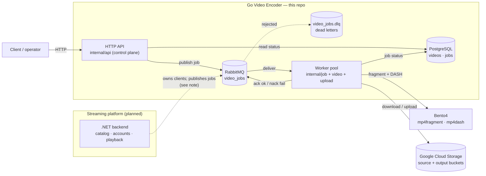
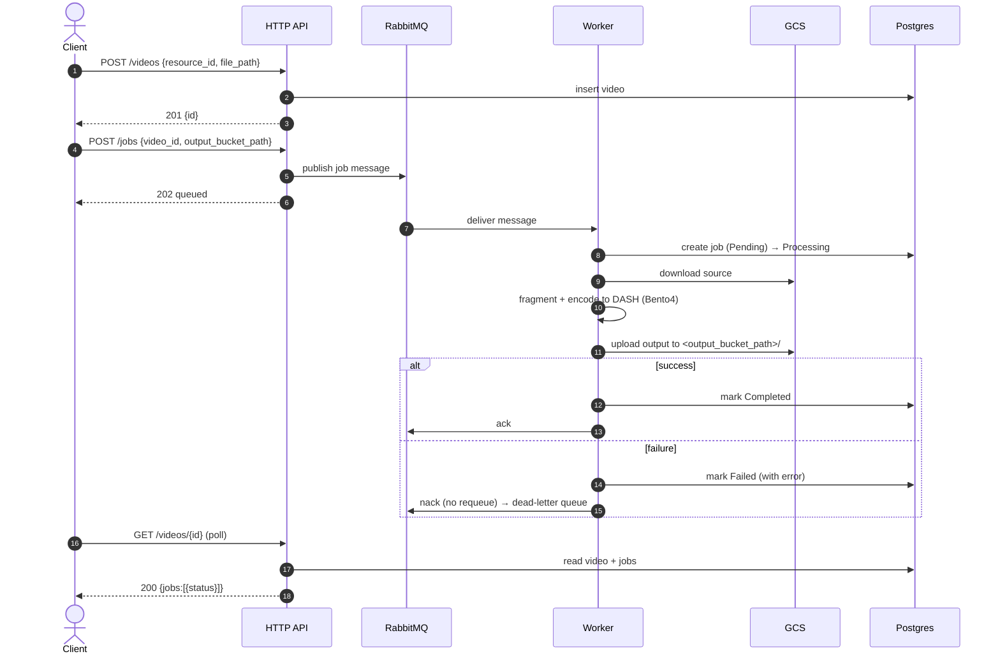
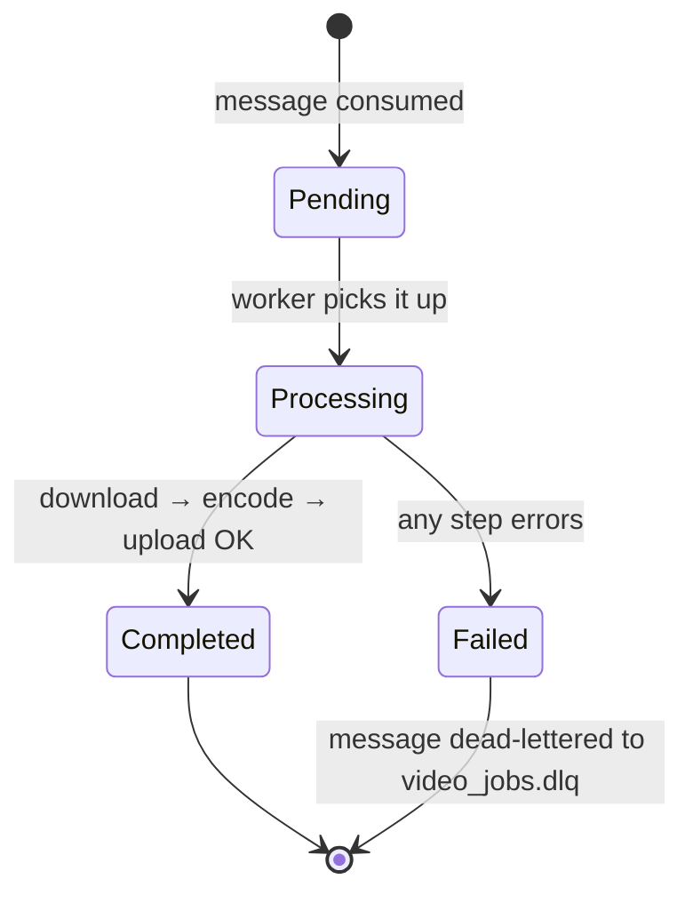

# Golang Video Encoder API

A Go service that turns an uploaded source video into streaming‑ready
[MPEG‑DASH](https://en.wikipedia.org/wiki/Dynamic_Adaptive_Streaming_over_HTTP)
output. It downloads a source file from Google Cloud Storage (GCS), fragments
and packages it with [Bento4](https://www.bento4.com/) (`mp4fragment` /
`mp4dash`), and uploads the generated artifacts back to GCS — driven by a
RabbitMQ work queue and fronted by a small HTTP control plane.

> **Bigger picture.** This is the encoding/transcoding pipeline for a planned
> **Netflix‑style streaming platform**. The user‑facing platform (catalog,
> accounts, playback) is being built separately as a **.NET counterpart**; this
> Go service is the specialized media‑processing microservice it feeds. See
> [Architectural note](#architectural-note-the-http-layer-is-provisional) for
> how the two are expected to fit together.

---

## How it fits together



The HTTP API and the worker run in the **same process** today, but they are
decoupled through the queue: the API only *publishes* work, and the worker only
*consumes* it.

---

## Job lifecycle



Job status is a simple state machine:



---

## HTTP API

Swagger UI is served at **`/swagger/index.html`** (spec at `/swagger/doc.json`).

| Method & path        | Purpose                                              | Success |
|----------------------|------------------------------------------------------|---------|
| `GET /healthz`       | Liveness probe                                       | 200     |
| `GET /readyz`        | Readiness — pings Postgres + checks RabbitMQ         | 200/503 |
| `POST /videos`       | Register a source video (`resource_id`, `file_path`) | 201     |
| `GET /videos/{id}`   | Fetch a video and its jobs                           | 200     |
| `POST /jobs`         | Enqueue an encode job (`video_id`, `output_bucket_path`) | 202 |
| `GET /jobs/{id}`     | Fetch a job's status                                 | 200     |

Processing is **asynchronous**: `POST /jobs` returns `202 queued`; poll
`GET /videos/{id}` (or `GET /jobs/{id}`) to watch the job reach `Completed`.
Malformed UUIDs return `400`; unknown-but-valid IDs return `404`.

The OpenAPI spec is generated from handler annotations with
[`swaggo/swag`](https://github.com/swaggo/swag); regenerate with:

```bash
swag init -g cmd/main.go -o docs --parseInternal
```

---

## Stack

- Go 1.25
- RabbitMQ (work queue + dead-letter queue)
- PostgreSQL via GORM v2 (job/video persistence)
- Google Cloud Storage (`cloud.google.com/go/storage`)
- Bento4 (`mp4fragment`, `mp4dash`) for DASH packaging
- `net/http` (stdlib router) + Swagger UI via `swaggo`

## Project structure

- `cmd/main.go` — bootstrap: config, DB, queue, worker pool, HTTP server, graceful shutdown
- `internal/api/` — HTTP control plane (handlers, DTOs, Swagger)
- `internal/job/` — job service, worker pool, queue consumer (`manager.go`), pipeline processor (`processor.go`)
- `internal/video/` — download, fragment, encode (Bento4), cleanup
- `internal/upload/` — concurrent upload of encoded output to GCS
- `internal/queue/` — RabbitMQ client (declare, publish, consume, reconnect, DLQ)
- `internal/repositories/` — GORM persistence adapters for `Video` and `Job`
- `internal/database/` — DB connection + in-memory sqlite test helper
- `domain/` — `Video` and `Job` entities + validation
- `docs/` — generated Swagger spec (do not edit by hand)

## Reliability behavior

- **At-least-once delivery**: a message is acknowledged only after its worker
  finishes. Failures are `Nack`ed without requeue and routed to
  `video_jobs.dlq` instead of being dropped.
- **Auto-reconnect**: the consumer reconnects to RabbitMQ with exponential
  backoff if the connection drops, then re-declares topology and resumes.
- **Bounded work**: channel QoS/prefetch matches the worker count; each job runs
  under a context deadline (`PROCESS_TIMEOUT`, default 30m).
- **Graceful shutdown**: SIGINT/SIGTERM drains the HTTP server and lets in-flight
  jobs finish before exit.

---

## Running

### 1) Configure

Copy `.env.example` to `.env` and adjust. The defaults target the bundled
`docker-compose` stack (Postgres db `encoder`, RabbitMQ, GCS credentials).

| Variable | Notes |
|----------|-------|
| `DSN` | Postgres DSN. In-container host is `db`; on the host use `localhost`. |
| `ENV` | `dev`/`prod` use Postgres; `test` uses in-memory sqlite. |
| `DEBUG` | `true` enables GORM SQL logging. |
| `AUTO_MIGRATE_DB` | Auto-migrate `videos`/`jobs` on boot. |
| `localStoragePath` | Scratch dir for download/encode (default `/tmp`). |
| `GOOGLE_APPLICATION_CREDENTIALS` | Path to the GCS service-account JSON. |
| `VIDEO_SOURCE_BUCKET` / `VIDEO_OUTPUT_BUCKET` | GCS buckets. Unset ⇒ processing disabled (creates pending jobs only). |
| `RABBITMQ_URL` / `RABBITMQ_QUEUE` / `RABBITMQ_CONSUMER` | Queue connection + names. |
| `CONCURRENCY_WORKERS` | Number of parallel workers. |
| `PROCESS_TIMEOUT` | Per-job time budget (Go duration). Default `30m`. |
| `HTTP_ADDR` | HTTP listen address. Default `:8080`. |

Credentials and `.env` are gitignored.

### 2) Start the stack

```bash
docker compose up -d            # db, rabbit, app
# host port for the API is overridable if 8080 is taken:
HTTP_HOST_PORT=8088 docker compose up -d app
```

### 3) Run the service (inside the app container — Bento4 lives there)

```bash
docker compose exec app go run ./cmd/main.go
```

Then open `http://localhost:8080/swagger/index.html`, or:

```bash
curl localhost:8080/healthz
VID=$(curl -s -XPOST localhost:8080/videos -d '{"resource_id":"demo","file_path":"invite.mp4"}' | jq -r .id)
curl -XPOST localhost:8080/jobs -d "{\"video_id\":\"$VID\",\"output_bucket_path\":\"out/$VID/\"}"
curl localhost:8080/videos/$VID     # poll until status == Completed
```

## Testing

```bash
go test ./...                       # hermetic (in-memory sqlite, no network)
go test -race ./...                 # race detector
go test -tags integration ./...     # real GCS + Bento4 (needs creds; run in container)
```

The GCS/Bento4 integration tests are gated behind the `integration` build tag so
the default suite stays hermetic and CI-friendly.

---

## Architectural note: the HTTP layer is provisional

This service currently plays **two roles in one process**: an HTTP **control
plane** (`internal/api`) and a queue **worker** (`internal/job` + pipeline).
That's handy for local development and for using the encoder standalone.

In the planned platform, the **.NET backend** is the primary client-facing
control plane and will likely submit encode jobs itself. So there is a decision
to make once the .NET service's responsibilities are settled:

- **Keep the HTTP layer** — if this service should stay independently
  usable/testable, expose its own status API, or act as a self-contained
  encoding microservice with its own surface.
- **Tear it down to a pure worker** — if the .NET side owns all client-facing
  APIs and simply publishes `video_jobs` messages. This repo would then drop
  `internal/api`, the Swagger docs, and the publisher connection, shrinking to
  *consumer + pipeline*.

The code is structured so either path is cheap: the worker does **not** depend on
`internal/api`. Tearing the HTTP layer down means removing the `internal/api`
package, the publisher client, and the HTTP wiring in `cmd/main.go` — nothing in
the processing pipeline changes. **Decision deferred** until the Go/.NET
responsibility split is finalized.

## Roadmap / known gaps

- Transient vs. permanent failures aren't distinguished yet — all processing
  failures go to the DLQ (no retry/backoff per message).
- No idempotency on reprocessing: a job redelivered after a reconnect creates a
  new row and overwrites its output objects.
- No authn/authz on the HTTP API (assumes a trusted network / internal caller).
- Resolve the [HTTP-layer decision](#architectural-note-the-http-layer-is-provisional) once the .NET counterpart lands.

## License

No license file has been added yet.
